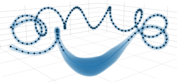

<div align="center">

# gsolver

**Breaking Time: A Fully Gaussian Framework for Distributed and Continuous-Time SLAM**

[](https://arxiv.org/abs/2606.06250)
[](https://www.ieee-ras.org/publications/ra-l)
[](LICENSE)


<!-- Teaser: Figure 1 from the paper (continuous-time mean + posterior covariance).
     Swap for a higher-resolution render or a Rerun capture (GIF) when available. -->


</div>

**gsolver** is a fully Gaussian, distributed framework for continuous-time SLAM that pairs
**Gaussian Belief Propagation (GBP)** with **Gaussian Process (GP)** motion priors. The GP
model gives a probabilistic trajectory with consistent interpolation and data-driven
hyperparameters; GBP provides a scalable, decentralized message-passing solver that extends
naturally to multi-robot and rolling-shutter settings, at runtimes comparable to existing
continuous-time methods.

The repository ships a C++17 core library with full Python bindings.

## 📄 Paper

> **Breaking Time: A Fully Gaussian Framework for Distributed and Continuous-Time SLAM**
> Davide Ceriola*, Simone Ferrari*, Luca Di Giammarino, Leonardo Brizi, Giorgio Grisetti
> *IEEE Robotics and Automation Letters (RA-L), 2026.* — [arXiv:2606.06250](https://arxiv.org/abs/2606.06250)

If you use this code in your research, please cite our paper:

```bibtex
@article{ceriola2026breaking,
  title   = {Breaking Time: A Fully Gaussian Framework for Distributed and Continuous-Time SLAM},
  author  = {Ceriola, Davide and Ferrari, Simone and Di Giammarino, Luca and Brizi, Leonardo and Grisetti, Giorgio},
  journal = {IEEE Robotics and Automation Letters (RA-L)},
  year    = {2026},
  note    = {To appear. arXiv:2606.06250}
}
```

## ✨ Features

- **Gaussian Belief Propagation solver** — efficient message-passing inference on factor graphs
- **Continuous-time GP motion priors** — smooth trajectory estimation with learnable hyperparameters
- **SE(3) pose optimization** — full 6-DoF estimation with velocity states
- **Bundle adjustment** and **incremental SLAM** — joint pose/landmark and online operation
- **Distributed & multi-camera** — decentralized message passing, no special synchronization
- **Real-time visualization** via [Rerun](https://rerun.io/), and a full **Python API** through nanobind

## 🚀 Quick Start

The fastest path is Docker, which handles every dependency and sets up X11 forwarding for visualization:

```bash
git clone git@github.com:rvp-group/gsolver.git
cd gsolver
./docker-run.sh                       # builds the image (first run) and drops you in the container
```

Inside the container, build the library and examples:

```bash
mkdir build && cd build
cmake .. -DGSOLVER_BUILD_EXAMPLES=ON -DGSOLVER_BUILD_PYTHON=ON
make -j$(nproc)
```

Then run a bundle-adjustment experiment on the bundled ChArUco dataset, with live 3D visualization:

```bash
./build/examples/cpp/charuco_experiment_ba \
    examples/data/datasets/charuco/printing_room_0.g2o \
    ./tmp/ba_result.tum 0.0 -visualize
```

> The synthetic pose-graph and prior experiments need datasets generated first (see below).
> Native (non-Docker) builds, dataset generation, all experiments, configuration, and the full
> C++/Python API are documented in **[docs/USAGE.md](docs/USAGE.md)**.

## 📦 Minimal Example

```python
import numpy as np
from gsolver import (
    FactorGraph, GbpSolver, SolverScheduleType,
    SE3PoseVel, SE3PoseVelValue, SE3PoseVelPrior, SE3PoseVelPoseVel,
)

fg = FactorGraph()

# Two pose + velocity states, initialized at the identity
def identity_state():
    s = SE3PoseVelValue()
    s.pose = np.eye(4)
    s.vel = np.zeros(6)
    return s

sigma12 = np.eye(12)
fg.add_variable(SE3PoseVel("x0", identity_state(), sigma12, 0.0))
fg.add_variable(SE3PoseVel("x1", identity_state(), sigma12, 1.0))

# Anchor the first state with a prior at the origin
fg.add_factor(SE3PoseVelPrior("prior_x0", np.eye(4), np.eye(6) * 1e-3), ["x0"])

# Relative motion measurement: 1 m along x between x0 and x1
z = np.eye(4); z[0, 3] = 1.0
fg.add_factor(SE3PoseVelPoseVel("odom_x0_x1", z, np.eye(6) * 1e-2), ["x0", "x1"])

# Run Gaussian Belief Propagation
solver = GbpSolver(SolverScheduleType.SYNCHRONOUS)
for _ in range(50):
    solver.perform_iteration(fg)

print(fg.get_variable("x1").mu.pose)   # optimized 4x4 pose; translation -> (1, 0, 0)
```

See [`examples/python/apps/`](examples/python/apps/) and [`examples/cpp/apps/`](examples/cpp/apps/) for complete, runnable programs.

## 📚 Documentation

Everything beyond the quick start lives in **[docs/USAGE.md](docs/USAGE.md)**:

- **Building** — Docker and native builds, dependencies, CMake options
- **Datasets** — generating synthetic trajectories and learning GP hyperparameters
- **Experiments** — every C++ and Python experiment, CLI arguments, configuration
- **API** — full C++ and Python reference
- **File formats** — g2o input and TUM output

Dataset details for the stereo-visual experiments are in
[`examples/data/datasets/stereo_visual/README.md`](examples/data/datasets/stereo_visual/README.md).

## 📜 License

Released under the BSD 3-Clause License — see [LICENSE](LICENSE).

## 🙏 Acknowledgements

- [Eigen](https://eigen.tuxfamily.org/) — linear algebra
- [nanobind](https://github.com/wjakob/nanobind) — Python bindings
- [Rerun](https://rerun.io/) — visualization
- [yaml-cpp](https://github.com/jbeder/yaml-cpp) — configuration parsing
